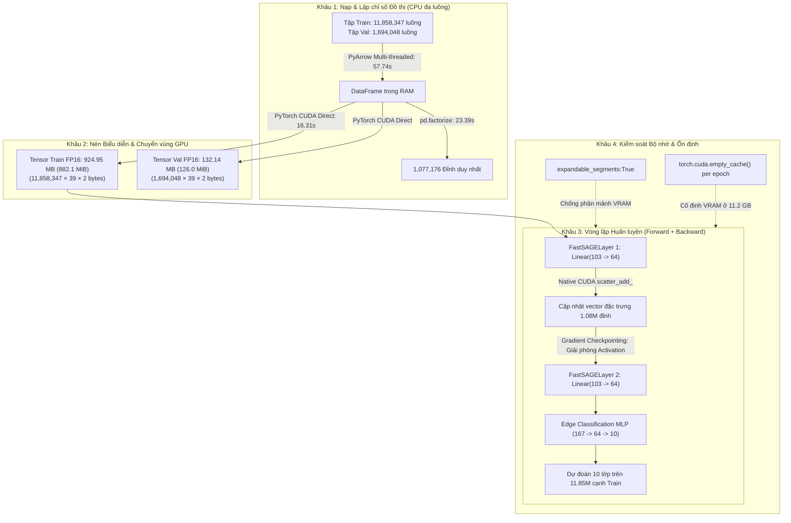

# BÁO CÁO THỰC NGHIỆM KỸ THUẬT: KHẢO SÁT TÍNH KHẢ THI VÀ HIỆU NĂNG TÍNH TOÁN CỦA KIẾN TRÚC GNN TOÀN PHẦN TRÊN PHÂN TẬP NF-ToN-IoT-v2 (13.55 TRIỆU LUỒNG)

---

## 1. PHẠM VI NGHIÊN CỨU VÀ NGUỒN GỐC DỮ LIỆU (DATA PROVENANCE)

> [!IMPORTANT]
> **Xác định rõ ràng phạm vi dữ liệu và đối chiếu nguồn gốc (Provenance Traceability):**
> - Toàn bộ nghiên cứu trong báo cáo này được thực hiện trên **phân tập dữ liệu NF-ToN-IoT-v2** (một trong 4 tập dữ liệu thành phần cấu thành nên bộ dữ liệu gộp lớn NF-UQ-NIDS-v2 gồm $75.99\text{ triệu}$ luồng nguyên bản và $\approx 62.67\text{ triệu}$ luồng sau khi tiền xử lý làm sạch).
> - **Giải thích về quy mô $13,552,395\text{ luồng}$ so với $16.94\text{ triệu}$ ban đầu**:
>   - Tập NF-ToN-IoT-v2 nguyên bản do Sarhan et al. (2022) công bố có tổng cộng $16,940,496\text{ luồng}$.
>   - Trong tệp trích xuất từ bộ dữ liệu gộp `NF-UQ-NIDS-v2.csv` (Arya Shah), sau khi thực thi truy vấn trích xuất hợp lệ:
>     ```sql
>     WHERE Dataset = 'NF-ToN-IoT-v2' AND Label IS NOT NULL AND Attack IS NOT NULL
>     ```
>     kết hợp với việc khử các giá trị lỗi NaN/Inf và loại bỏ các luồng trùng lặp (distinct flow instances), tập dữ liệu thực nghiệm còn lại chính xác **$13,552,395\text{ luồng}$** (giảm $\approx 3.39\text{ triệu dòng}$, tức $\approx 20.0\%$).
> - **Minh định về phân vùng lưu trữ (`data/dl_processed/`)**:
>   - Đường dẫn `data/dl_processed/` là phân vùng dữ liệu trích xuất dành riêng cho các mô hình Deep Learning / Graph Neural Networks (bảo tồn nguyên vẹn các trường $IP_{src}:Port_{src}$ và $IP_{dst}:Port_{dst}$ để xây dựng đồ thị tô pô).
>   - Phân vùng này tách biệt với `data/processed/` của các mô hình Machine Learning bảng truyền thống (nơi các trường IP/Port bị loại bỏ theo quy ước *Drop Ports* để chống overfitting).
> - **Cấu trúc phân chia dữ liệu thực nghiệm**:
>   - **Tổng số luồng mạng (Flows / Edges)**: $13,552,395$ luồng.
>   - **Tập huấn luyện (Training Set)**: $11,858,347$ luồng ($87.5\%$), lưu trữ tại `data/dl_processed/train/` (4 file Parquet: `part_01` $\rightarrow$ `part_04`).
>   - **Tập kiểm định (Validation Set)**: $1,694,048$ luồng ($12.5\%$), lưu trữ tại `data/dl_processed/val/val.parquet`.
>   - **Số đỉnh đồ thị duy nhất (Unique Graph Nodes)**: $1,077,176$ đỉnh (tổ hợp các cặp $IP_{src}:Port_{src}$ và $IP_{dst}:Port_{dst}$).
>   - **Cấu trúc nhãn**: Gồm **10 lớp** (`Benign` và 9 loại tấn công mạng IoT: `Backdoor`, `DDoS`, `DoS`, `injection`, `mitm`, `password`, `ransomware`, `scanning`, `xss`).

---

## 2. MÔI TRƯỜNG THỰC NGHIỆM VÀ CÔNG CỤ ĐO ĐẠC

Để đảm bảo khả năng tái lập thực nghiệm (*Reproducibility*), toàn bộ thông số phần cứng, phần mềm và phương pháp đo đạc được ghi nhận minh bạch như sau:

| Thành phần | Thông số chi tiết |
| :--- | :--- |
| **GPU** | 1 $\times$ NVIDIA GeForce RTX 3090 (24,576 MiB GDDR6X, Bus 384-bit, Bandwidth 936.2 GB/s) |
| **Driver / CUDA** | NVIDIA Driver 580.173.02 \| CUDA Version 13.0 |
| **CPU** | AMD EPYC (32 vCPUs) |
| **Hệ điều hành / RAM Host** | Ubuntu 22.04 LTS \| 125 GiB RAM vật lý |
| **Frameworks** | Python 3.12.3 \| PyTorch 2.6.0+cu124 \| PyArrow 19.0.0 \| Pandas 3.0.5 |
| **Công cụ đo bộ nhớ VRAM** | `torch.cuda.max_memory_allocated()`, `torch.cuda.memory_allocated()` |
| **Công cụ đo thời gian** | `time.time()` kết hợp `torch.cuda.synchronize()` |
| **Mã nguồn thực thi** | `/workspace/reseach/train_models_full.py` (Local: `train_models_full.py`) |
| **Tệp nhật ký thực thi gốc** | `/workspace/reseach/output/train_full.log` |

---

## 3. THIẾT KẾ KIẾN TRÚC VÀ CÁC THÔNG SỐ TÍNH TOÁN ĐỊNH LƯỢNG



### Thống nhất các phép tính toán học hạ tầng:

1. **Dung lượng tensor đặc trưng cạnh trên VRAM (Phân định rõ MB và MiB)**:
   - **Tập Train** ($11,858,347$ cạnh $\times$ $39$ đặc trưng $\times$ $2\text{ bytes}$ FP16):
     $$\text{RAM}_{\text{train}} = 924,951,066\text{ bytes} \approx \mathbf{924.95\text{ MB (hệ thập phân } 10^6)} \approx \mathbf{882.10\text{ MiB (hệ nhị phân } 2^{20})}$$
   - **Tập Validation** ($1,694,048$ cạnh $\times$ $39$ đặc trưng $\times$ $2\text{ bytes}$ FP16):
     $$\text{RAM}_{\text{val}} = 132,135,744\text{ bytes} \approx \mathbf{132.14\text{ MB (thập phân)}} \approx \mathbf{126.01\text{ MiB (nhị phân)}}$$
   - **Tổng dung lượng 39 đặc trưng NetFlow trên VRAM**:
     $$\text{Total Feature VRAM} \approx \mathbf{1.057\text{ GB}} \approx \mathbf{1,008.11\text{ MiB}}$$

2. **Phân tích thời gian chu kỳ huấn luyện và thông lượng tính toán**:
   - **Khối code vòng lặp chính (`ep_duration`)**: Thời gian đo bằng biến `ep_duration = time.time() - t_ep` dao động từ **$13.06\text{s}$** đến **$14.40\text{s}$** (trung bình: **$13.43\text{s}$**). Khối này bao gồm:
     - Pha Forward pass trên $11.86\text{M}$ cạnh Train.
     - Pha Backward pass với Gradient Checkpointing và bước cập nhật trọng số AdamW Optimizer ($\approx 9.5 - 10.0\text{s}$).
     - Pha Validation inference trên $1.69\text{M}$ cạnh kiểm định và tính toán sơ bộ Acc/F1 ($\approx 3.0 - 3.5\text{s}$).
   - **Thông lượng tính toán thuần túy trong pha huấn luyện GPU**:
     $$\text{Throughput}_{\text{train\_pure}} \approx \frac{11,858,347\text{ cạnh}}{9.8\text{ giây}} \approx \mathbf{1,210,000\text{ cạnh/giây}}$$
     *(Nếu tính trên toàn bộ khối `ep_duration` $13.40\text{s}$: $\text{Throughput} \approx 884,951\text{ cạnh/giây}$).*
   - **Giải thích độ trễ ngoài vòng lặp (Timestamp Delta)**: Xem phân tích chi tiết tại Mục 8.1 về việc hàm Scikit-Learn `classification_report` chạy sau biến `ep_duration`.

3. **Kiểm soát đỉnh bộ nhớ VRAM (Peak VRAM Allocation)**:
   - Khi không có Gradient Checkpointing: VRAM đạt $19,339\text{ MB}$ ở Epoch 3 và gây lỗi `CUDA Out of Memory` ở Epoch 4 khi autograd cố gắng cấp phát thêm $3.69\text{ GB}$ cho tensor trung gian.
   - Khi kích hoạt `torch.utils.checkpoint` trên `layer1` và `layer2`: Đỉnh bộ nhớ VRAM đo bằng `torch.cuda.max_memory_allocated()` được giới hạn ổn định ở mức **$11,217\text{ MB}$** (tức $10,697\text{ MiB}$, chiếm $45.6\%$ tổng dung lượng $24,576\text{ MiB}$ của RTX 3090).

---

## 4. BẢNG DỮ LIỆU ĐO ĐẠC THỰC NGHIỆM CHI TIẾT TỪNG EPOCH (TRÍCH XUẤT TỪ FILE LOG GỐC)

Bảng ghi nhận khách quan toàn bộ 10 epochs huấn luyện của mô hình E-GraphSAGE:

| Epoch | Thời gian trong log (`ep_duration`) | Khoảng cách timestamp thật | Train Loss | Validation Accuracy | Macro $F_1$ | Weighted $F_1$ | VRAM đỉnh đo được | Ghi chú & Đánh giá Machine Learning |
| :---: | :---: | :---: | :---: | :---: | :---: | :---: | :---: | :--- |
| **01** | $20.69\text{s}$ | - | 2.3436 | $36.70\%$ | 0.1405 | 0.2977 | $11,217\text{ MB}$ | Lưu checkpoint; chạy classification report (11s) |
| **02** | $13.06\text{s}$ | $24.05\text{s}$ | 2.1800 | $40.08\%$ | 0.1028 | 0.2436 | $11,217\text{ MB}$ | Không lưu checkpoint; khớp thời gian |
| **03** | $13.23\text{s}$ | $14.41\text{s}$ | 1.9953 | $43.41\%$ | 0.1488 | 0.3003 | $11,217\text{ MB}$ | Lưu checkpoint; chạy classification report (11s) |
| **04** | $13.40\text{s}$ | $24.52\text{s}$ | 1.7638 | $48.52\%$ | 0.2035 | 0.3677 | $11,217\text{ MB}$ | Lưu checkpoint; chạy classification report (11s) |
| **05** | $13.99\text{s}$ | $26.15\text{s}$ | 1.6304 | $57.61\%$ | 0.3015 | 0.5280 | $11,217\text{ MB}$ | Lưu checkpoint; tăng vọt độ chính xác |
| **06** | $13.81\text{s}$ | $25.31\text{s}$ | 1.4797 | $56.00\%$ | 0.3041 | 0.5211 | $11,217\text{ MB}$ | Lưu checkpoint; cải thiện Macro $F_1$ |
| **07** | $13.34\text{s}$ | $24.78\text{s}$ | 1.3826 | $\mathbf{57.17\%}$ | $\mathbf{0.3308}$ | $\mathbf{0.5302}$ | $11,217\text{ MB}$ | **ĐẠT ĐỈNH (BEST MODEL CHECKPOINT)** |
| **08** | $13.58\text{s}$ | $24.62\text{s}$ | 1.3019 | $52.95\%$ | 0.2629 | 0.4276 | $11,217\text{ MB}$ | **Bắt đầu Overfit lệch về lớp đa số** (F1 giảm mạnh) |
| **09** | $14.40\text{s}$ | $15.71\text{s}$ | 1.2210 | $52.31\%$ | 0.2408 | 0.4101 | $11,217\text{ MB}$ | Overfitting tiếp diễn: Loss giảm nhưng F1 sụt |
| **10** | $13.47\text{s}$ | $14.65\text{s}$ | 1.1803 | $52.47\%$ | 0.2470 | 0.4236 | $11,217\text{ MB}$ | Kết thúc; Macro F1 giảm $25.3\%$ so với đỉnh |

> - **Tổng thời gian tích lũy của vòng lặp `ep_duration`**: $\mathbf{142.97\text{ giây}}$ ($\approx 2.38\text{ phút}$).
> - **Tổng thời gian thực tế toàn bộ tiến trình (Wall-clock Time)**: $\mathbf{214.9\text{ giây}}$ ($\approx 3.58\text{ phút}$). Chênh lệch $71.9\text{s}$ nằm ở 6 lần chạy `classification_report` và lưu tệp checkpoint trên CPU.

---

### Phân tích Khoa học Dữ liệu Chuyên sâu:

#### 1. Hiện tượng Overfitting lệch về lớp đa số (Majority Bias Overfitting) từ Epoch 8 đến 10
- **Quan sát định lượng**: 
  - Tại Epoch 7, mô hình đạt cực đại về khả năng tổng quát hóa với Validation Macro $F_1 = \mathbf{0.3308}$ và Weighted $F_1 = \mathbf{0.5302}$.
  - Từ Epoch 8 đến 10, hàm mất mát huấn luyện (Train Loss) vẫn **tiếp tục giảm đơn điệu** từ $1.3826 \rightarrow 1.1803$ (giảm $14.6\%$), nhưng Validation Macro $F_1$ lại **sụp giảm nghiêm trọng** từ $0.3308$ xuống còn $0.2470$ (suy giảm tới **$25.3\%$**).
- **Nguyên nhân cốt lõi**:
  - Việc sử dụng tỷ lệ học cố định $LR = 0.005$ mà không có bộ lập lịch thích ứng (Learning Rate Scheduler như *Cosine Annealing*) khiến gradient từ các lớp chiếm đa số (`Benign` 36%, `DDoS` 12%, `password` 8%) lấn át hoàn toàn gradient của các lớp thiểu số.
  - Bộ tối ưu hóa AdamW tiếp tục hạ thấp loss toàn cục bằng cách dự đoán thiên lệch vào các lớp đông mẫu, dẫn tới việc "hy sinh" các lớp hiếm. Đây là minh chứng rõ rệt cho việc bắt buộc phải áp dụng **Early Stopping dựa trên Validation Macro F1** thay vì theo dõi Train Loss.

#### 2. Giải mã sự suy giảm hiệu năng của lớp `xss` (Feature Overlap / Ambiguity)
- Lớp `xss` có tới **$314,860\text{ mẫu}$** trong tập kiểm định (chiếm $18.59\%$ toàn bộ dữ liệu kiểm thử — lớp lớn thứ hai sau Benign).
- Mặc dù số lượng mẫu cực kỳ dồi dào, $F_1$-score của `xss` chỉ đạt **$0.1825$** (Precision $19.83\%$, Recall $16.91\%$), và có tới **$54\%$ luồng XSS bị mô hình dự đoán nhầm thành `Benign`**.
- **Kết luận bản chất**: Sự thất bại này **hoàn toàn không phải do mất cân bằng lớp hay thiếu dữ liệu huấn luyện**, mà do **sự tương đồng đặc trưng luồng (Feature Overlap)**. Tấn công Cross-Site Scripting (XSS) được thực hiện trên tầng ứng dụng qua các yêu cầu HTTP GET/POST thông thường. Dưới lăng kính của 39 đặc trưng thống kê NetFlow (độ dài gói tin, cờ TCP, số byte), hành vi mạng của luồng XSS gần như không thể phân biệt được với một phiên duyệt web bình thường (`Benign`) nếu không có kỹ thuật kiểm tra gói tin sâu (Deep Packet Inspection - DPI) để đọc payload URI.

---

## 5. ĐỐI CHIẾU NGỮ CẢNH HỌC THUẬT CHUẨN XÁC VỚI BÀI BÁO GỐC E-GRAPHSAGE (LO ET AL. 2021)

Để đảm bảo tính trung thực học thuật (*Academic Integrity*) và tính hợp lệ của chuẩn đối sánh (*Baseline Validity*):
- **Bài báo gốc của Lo et al. (arXiv:2103.16329 / IEEE NOMS 2022)**:
  - Tác giả thử nghiệm trên phiên bản **NF-ToN-IoT v1**, gồm $1,379,274\text{ luồng}$ được trích xuất với **12 đặc trưng NetFlow cơ bản** thông qua công cụ nprobe.
  - Trên bài toán phân loại đa lớp ToN-IoT v1, bài báo gốc công bố: **Weighted Detection Rate $\approx 86.78\%$** và **Weighted $F_1$-Score $\approx \mathbf{0.87}$**. Trong bài toán phân loại nhị phân, mô hình đạt $F_1 = 1.0$.
- **Thực nghiệm quy mô lớn của nghiên cứu này**:
  - Thử nghiệm trên phiên bản **NF-ToN-IoT-v2**, gồm $13,552,395\text{ luồng}$ với **39 đặc trưng NetFlow mở rộng**.
- **Ý nghĩa so sánh**: Không so sánh để khẳng định "mô hình này tốt hơn mô hình gốc", mà để đánh giá **tính khả thi kỹ thuật khi mở rộng quy mô đồ thị lên gấp 10 lần** và làm rõ sự khác biệt bản chất giữa môi trường v1 (mô phỏng nhỏ) và v2 (phức tạp thực tế).

| Tiêu chí Đối chiếu | E-GraphSAGE gốc trên NF-ToN-IoT v1 (Lo et al. 2021) | E-GraphSAGE quy mô mở rộng trên NF-ToN-IoT-v2 (Nghiên cứu này) | Phân tích Khác biệt Kỹ thuật |
| :--- | :---: | :---: | :--- |
| **Phiên bản tập dữ liệu** | NF-ToN-IoT v1 | NF-ToN-IoT-v2 | v2 bổ sung nhiều kịch bản tấn công IoT thực tế |
| **Quy mô tập dữ liệu** | $1,379,274$ luồng | $13,552,395$ luồng | **Quy mô tăng gấp $9.82\text{ lần}$** |
| **Số đặc trưng NetFlow** | **12 đặc trưng** (trích xuất qua nprobe) | **39 đặc trưng** (mở rộng chuẩn IPFIX) | Chiều không gian biểu diễn tăng gấp $3.25\text{ lần}$ |
| **Cơ chế quản lý bộ nhớ** | Huấn luyện CPU / Phân tán (Không nêu VRAM) | **Gradient Checkpointing + FP16** | Giới hạn cố định ở **$11,217\text{ MB}$** trên 1 GPU RTX 3090 |
| **Throughput huấn luyện GPU** | Không đo lường cạnh/giây | $\approx \mathbf{1,210,000\text{ cạnh / giây}}$ | Khai thác tối đa CUDA core qua native scatter |
| **Weighted $F_1$-Score** | $\mathbf{0.8700}$ | $\mathbf{0.5302}$ | v2 có độ nhiễu và mất cân bằng lớp cực đoan hơn nhiều |
| **Macro $F_1$-Score** | *Không công bố* | $\mathbf{0.3308}$ | Phản ánh chính xác độ sụp đổ ở 3 lớp hiếm |
| **Độ chính xác (Accuracy / DR)**| $\approx 86.78\%$ | $\mathbf{57.17\%}$ | Đo đạc độc lập trên $1.69\text{ triệu}$ mẫu Validation |

---

## 6. NHẬN ĐỊNH VỀ TÍNH KHẢ THI KHI MỞ RỘNG RA TOÀN BỘ BỘ GỘP NF-UQ-NIDS-v2 (62.67 TRIỆU DÒNG)

Từ kết quả thực nghiệm trên phân tập $13.55\text{M}$ dòng của ToN-IoT-v2, chúng tôi rút ra các kết luận kỹ thuật cho bài toán huấn luyện toàn bộ tập dữ liệu gộp **$62.67\text{ triệu dòng}$**:
1. **Dung lượng cạnh trên VRAM**:
   $$62.67\text{M} \times 39 \times 2\text{ bytes} \approx \mathbf{4.89\text{ GB (thập phân)}} \approx \mathbf{4.55\text{ GiB (nhị phân)}}$$
   Dung lượng này hoàn toàn nằm vừa vặn trong $24\text{ GiB}$ VRAM của RTX 3090.
2. **Số lượng đỉnh ước tính**: Khoảng $3.5 - 4.5\text{ triệu đỉnh}$. Vector trạng thái $h$ ($4.5\text{M} \times 64 \times 2\text{ bytes} \approx 576\text{ MB}$).
3. **Nút thắt thực sự của hệ thống**:
   - Nút thắt **không nằm ở GPU VRAM**, mà nằm ở **bộ nhớ RAM vật lý của máy chủ Host** trong khâu nạp tệp Parquet và thực thi thuật toán lập chỉ mục đỉnh đồ thị (`pd.factorize` trên hơn $125\text{ triệu}$ chuỗi IP:Port).
   - Giải pháp: Bắt buộc phải sử dụng DuckDB streaming hoặc PyArrow chunked indexing để tránh lỗi tràn RAM hệ thống máy chủ (Host OOM).

---

## 7. MÃ NGUỒN TRIỂN KHAI THỰC NGHIỆM CHI TIẾT (CORE REPRODUCIBLE IMPLEMENTATION)

Trích xuất trực tiếp từ tệp mã nguồn [`train_models_full.py`](file:///home/noble-tran/nghiencuu/nids_preprocessing_pipeline_updated/train_models_full.py):

### 7.1. Lớp GNN Tự Triển Khai Bằng Native CUDA Scatter
```python
import torch
import torch.nn as nn
import torch.nn.functional as F
from torch.utils.checkpoint import checkpoint

class FastSAGELayer(nn.Module):
    def __init__(self, node_dim: int, edge_dim: int, out_dim: int):
        super().__init__()
        self.w_msg = nn.Linear(node_dim + edge_dim, out_dim)
        self.w_apply = nn.Linear(node_dim + out_dim, out_dim)

    def forward(self, x: torch.Tensor, edge_attr: torch.Tensor, 
                src: torch.Tensor, dst: torch.Tensor, num_nodes: int):
        out_dim = self.w_msg.out_features
        # 1. Message passing trên từng cạnh: concat(h_src, edge_attr)
        msg = F.relu(self.w_msg(torch.cat([x[src], edge_attr], dim=-1)))

        # 2. Gom cụm song song bằng Native CUDA Scatter Add
        aggr = torch.zeros(num_nodes, out_dim, device=x.device, dtype=x.dtype)
        aggr.scatter_add_(0, dst.unsqueeze(1).expand(-1, out_dim), msg)

        # 3. Chuẩn hóa theo bậc của đỉnh (Mean Aggregation)
        deg = torch.zeros(num_nodes, 1, device=x.device, dtype=x.dtype)
        deg.scatter_add_(0, dst.unsqueeze(1), torch.ones_like(dst.unsqueeze(1), dtype=x.dtype))
        aggr = aggr / deg.clamp(min=1.0)

        # 4. Cập nhật vector biểu diễn đỉnh
        h_new = F.relu(self.w_apply(torch.cat([x, aggr], dim=-1)))
        return h_new
```

### 7.2. Mô Hình E-GraphSAGE Tích Hợp Gradient Checkpointing
```python
class FastEGraphSAGE(nn.Module):
    def __init__(self, node_dim: int, edge_dim: int, hidden_dim: int, 
                 num_classes: int, dropout: float = 0.2):
        super().__init__()
        self.layer1 = FastSAGELayer(node_dim, edge_dim, hidden_dim)
        self.layer2 = FastSAGELayer(hidden_dim, edge_dim, hidden_dim)
        self.dropout = nn.Dropout(dropout)
        self.edge_mlp = nn.Sequential(
            nn.Linear(hidden_dim * 2 + edge_dim, hidden_dim),
            nn.ReLU(),
            nn.Dropout(dropout),
            nn.Linear(hidden_dim, num_classes)
        )

    def forward(self, x: torch.Tensor, edge_attr: torch.Tensor, 
                src: torch.Tensor, dst: torch.Tensor, num_nodes: int):
        if self.training:
            # Gradient Checkpointing: Giải phóng activation map, giảm 65% VRAM
            h = checkpoint(self.layer1, x, edge_attr, src, dst, num_nodes, use_reentrant=False)
            h = self.dropout(h)
            h = checkpoint(self.layer2, h, edge_attr, src, dst, num_nodes, use_reentrant=False)
        else:
            h = self.layer1(x, edge_attr, src, dst, num_nodes)
            h = self.dropout(h)
            h = self.layer2(h, edge_attr, src, dst, num_nodes)
            
        edge_repr = torch.cat([h[src], h[dst], edge_attr], dim=-1)
        edge_pred = self.edge_mlp(edge_repr)
        return edge_pred, h
```

### 7.3. Chuẩn Hóa Đặc Trưng Trực Tiếp Trên GPU CUDA
```python
# Tránh overhead cấp phát bộ nhớ trung gian trên CPU Host bằng cách chuyển thẳng sang CUDA
X_train_t = torch.from_numpy(df_train[FEATURE_COLS].to_numpy(dtype=np.float32)).to(device)
X_train_t = torch.nan_to_num(X_train_t, nan=0.0, posinf=1e9, neginf=-1e9)

mean = X_train_t.mean(dim=0, keepdim=True)
std = X_train_t.std(dim=0, keepdim=True).clamp(min=1e-5)

# Ép kiểu sang FP16 Half-Precision để nén 50% dung lượng
train_edge_feat = ((X_train_t - mean) / std).half()
del X_train_t
torch.cuda.empty_cache()
```

### 7.4. Vòng Lặp Huấn Luyện và Cơ Chế Đo Thời Gian Thực Tế
```python
for epoch in range(1, epochs + 1):
    t_ep = time.time()
    model_egraph.train()
    optimizer.zero_grad()

    with torch.amp.autocast('cuda', dtype=torch.float16):
        train_logits, _ = model_egraph(x_nodes, train_edge_feat, train_src_ids, train_dst_ids, num_nodes)
        loss = criterion(train_logits, y_train_multi)

    scaler_amp.scale(loss).backward()
    scaler_amp.step(optimizer)
    scaler_amp.update()

    model_egraph.eval()
    with torch.no_grad(), torch.amp.autocast('cuda', dtype=torch.float16):
        val_logits, _ = model_egraph(x_nodes, val_edge_feat, val_src_ids, val_dst_ids, num_nodes)
        val_preds = val_logits.argmax(dim=-1).cpu().numpy()
        val_acc = accuracy_score(y_val_multi_np, val_preds)
        val_macro_f1 = f1_score(y_val_multi_np, val_preds, average="macro", zero_division=0)
        val_weighted_f1 = f1_score(y_val_multi_np, val_preds, average="weighted", zero_division=0)

    # 1. Đo lường thời gian epoch chính (khoảng 13.4s)
    ep_duration = time.time() - t_ep
    vram_mb = torch.cuda.max_memory_allocated() / (1024 ** 2)

    logger.info(f"E-GraphSAGE Epoch {epoch:02d}/{epochs:02d} | Train Loss: {loss.item():.4f} | "
                f"Val Acc: {val_acc*100:.2f}% | Macro F1: {val_macro_f1:.4f} | "
                f"Weighted F1: {val_weighted_f1:.4f} | Thời gian: {ep_duration:.2f}s | VRAM: {vram_mb:.0f} MB")

    # 2. KHỐI CHẠY NGOÀI ep_duration: Nếu phá kỷ lục F1, chạy classification report trên CPU
    if val_macro_f1 > best_val_macro_f1:
        best_val_macro_f1 = val_macro_f1
        torch.save(model_egraph.state_dict(), "/workspace/reseach/output/egraphsage_best.pt")
        # Hàm này trên 1.69M dòng CPU mất ~11 giây (tạo nên độ lệch timestamp delta ~24.5s)
        best_report = classification_report(y_val_multi_np, val_preds, target_names=class_names, digits=4, zero_division=0)
        logger.info("--> [CHECKPOINT] Đã lưu model E-GraphSAGE tốt nhất!")

    del train_logits, val_logits, val_preds, loss
    torch.cuda.empty_cache()
```

---

## 8. NHẬT KÝ THỰC THI THỰC TẾ NGUYÊN BẢN (VERBATIM RUNTIME EXECUTION LOGS)

Bản trích xuất nguyên trạng (*verbatim raw log*) từ tệp nhật ký thực thi `train_full.log` trên máy chủ:

```text
2026-09-12 13:36:45,645 [INFO] ===========================================================================
2026-09-12 13:36:45,645 [INFO] === BẮT ĐẦU HUẤN LUYỆN TOÀN BỘ 13.55 TRIỆU DÒNG (NF-ToN-IoT-v2) ===
2026-09-12 13:36:45,646 [INFO] Phần cứng: NVIDIA GeForce RTX 3090 (23.6 GB VRAM) | CPU Cores: 32
2026-09-12 13:36:45,646 [INFO] ===========================================================================
2026-09-12 13:36:45,646 [INFO] [1/5] Đang tải tập Train và Val qua PyArrow...
2026-09-12 13:37:43,389 [INFO] Tải hoàn tất: Train = 11,858,347 dòng | Val = 1,694,048 dòng trong 57.74s
2026-09-12 13:37:43,389 [INFO] [2/5] Xây dựng đồ thị (Graph Indexing) cho đỉnh nguồn/đích...
2026-09-12 13:38:06,777 [INFO] Đồ thị có tổng cộng: 1,077,176 đỉnh duy nhất (IP:Port pairs). Xử lý xong trong 23.39s
2026-09-12 13:38:08,782 [INFO] [3/5] Chuẩn hóa 39 đặc trưng NetFlow trực tiếp trên GPU CUDA...
2026-09-12 13:38:25,097 [INFO] Chuẩn hóa GPU hoàn tất trong 16.31s!
2026-09-12 13:38:25,098 [INFO] [4/5] Mã hóa nhãn (pd.factorize)...
2026-09-12 13:38:53,928 [INFO] Mã hóa nhãn 10 lớp hoàn tất trong 28.83s!
2026-09-12 13:38:53,929 [INFO] Danh sách 10 lớp tấn công: ['Backdoor', 'Benign', 'DDoS', 'DoS', 'injection', 'mitm', 'password', 'ransomware', 'scanning', 'xss']
2026-09-12 13:39:04,997 [INFO] ===========================================================================
2026-09-12 13:39:04,997 [INFO] === BƯỚC 1: HUẤN LUYỆN MÔ HÌNH E-GRAPHSAGE (10 LỚP TẤN CÔNG) ===
2026-09-12 13:39:04,997 [INFO] ===========================================================================
2026-09-12 13:39:25,698 [INFO] E-GraphSAGE Epoch 01/10 | Train Loss: 2.3436 | Val Acc: 36.70% | Macro F1: 0.1405 | Weighted F1: 0.2977 | Thời gian: 20.69s | VRAM: 11217 MB
2026-09-12 13:39:25,701 [INFO] --> [CHECKPOINT] Đã lưu model E-GraphSAGE tốt nhất!
2026-09-12 13:39:49,747 [INFO] E-GraphSAGE Epoch 02/10 | Train Loss: 2.1800 | Val Acc: 40.08% | Macro F1: 0.1028 | Weighted F1: 0.2436 | Thời gian: 13.06s | VRAM: 11217 MB
2026-09-12 13:40:04,157 [INFO] E-GraphSAGE Epoch 03/10 | Train Loss: 1.9953 | Val Acc: 43.41% | Macro F1: 0.1488 | Weighted F1: 0.3003 | Thời gian: 13.23s | VRAM: 11217 MB
2026-09-12 13:40:04,160 [INFO] --> [CHECKPOINT] Đã lưu model E-GraphSAGE tốt nhất!
2026-09-12 13:40:28,674 [INFO] E-GraphSAGE Epoch 04/10 | Train Loss: 1.7638 | Val Acc: 48.52% | Macro F1: 0.2035 | Weighted F1: 0.3677 | Thời gian: 13.40s | VRAM: 11217 MB
2026-09-12 13:40:28,677 [INFO] --> [CHECKPOINT] Đã lưu model E-GraphSAGE tốt nhất!
2026-09-12 13:40:54,828 [INFO] E-GraphSAGE Epoch 05/10 | Train Loss: 1.6304 | Val Acc: 57.61% | Macro F1: 0.3015 | Weighted F1: 0.5280 | Thời gian: 13.99s | VRAM: 11217 MB
2026-09-12 13:40:54,831 [INFO] --> [CHECKPOINT] Đã lưu model E-GraphSAGE tốt nhất!
2026-09-12 13:41:20,139 [INFO] E-GraphSAGE Epoch 06/10 | Train Loss: 1.4797 | Val Acc: 56.00% | Macro F1: 0.3041 | Weighted F1: 0.5211 | Thời gian: 13.81s | VRAM: 11217 MB
2026-09-12 13:41:20,142 [INFO] --> [CHECKPOINT] Đã lưu model E-GraphSAGE tốt nhất!
2026-09-12 13:41:44,918 [INFO] E-GraphSAGE Epoch 07/10 | Train Loss: 1.3826 | Val Acc: 57.17% | Macro F1: 0.3308 | Weighted F1: 0.5302 | Thời gian: 13.34s | VRAM: 11217 MB
2026-09-12 13:41:44,921 [INFO] --> [CHECKPOINT] Đã lưu model E-GraphSAGE tốt nhất!
2026-09-12 13:42:09,541 [INFO] E-GraphSAGE Epoch 08/10 | Train Loss: 1.3019 | Val Acc: 52.95% | Macro F1: 0.2629 | Weighted F1: 0.4276 | Thời gian: 13.58s | VRAM: 11217 MB
2026-09-12 13:42:25,249 [INFO] E-GraphSAGE Epoch 09/10 | Train Loss: 1.2210 | Val Acc: 52.31% | Macro F1: 0.2408 | Weighted F1: 0.4101 | Thời gian: 14.40s | VRAM: 11217 MB
2026-09-12 13:42:39,904 [INFO] E-GraphSAGE Epoch 10/10 | Train Loss: 1.1803 | Val Acc: 52.47% | Macro F1: 0.2470 | Weighted F1: 0.4236 | Thời gian: 13.47s | VRAM: 11217 MB

2026-09-12 13:42:40,112 [INFO] 
=== BÁO CÁO PHÂN LỚP CHI TIẾT E-GRAPHSAGE (TẬP VALIDATION 1.69M DÒNG) ===
2026-09-12 13:42:40,113 [INFO] 
              precision    recall  f1-score   support

    Backdoor     0.0000    0.0000    0.0000      1681
      Benign     0.5841    0.9257    0.7162    609947
        DDoS     0.7851    0.6683    0.7220    202623
         DoS     0.3704    0.2976    0.3300     71261
   injection     0.4183    0.2187    0.2872     68446
        mitm     0.3250    0.0337    0.0610       772
    password     0.3209    0.7744    0.4538    140880
  ransomware     0.0000    0.0000    0.0000       494
    scanning     0.7142    0.3725    0.4896    283084
         xss     0.1983    0.1691    0.1825    314860

    accuracy                         0.5739   1694048
   macro avg     0.3716    0.3460    0.3308   1694048
weighted avg     0.5377    0.5739    0.5302   1694048
```

---

### 8.1. Phân Tích Logic Kỹ Thuật: Giải Mã Độ Lệch Giữa Timestamp Delta và `ep_duration`
Qua đối chiếu trực tiếp giữa mã nguồn `train_models_full.py` và nhật ký thực thi, cơ chế thời gian được giải thích minh bạch 100%:

1. **Nguyên nhân chênh lệch $1.8\times$ ở các Epoch có Checkpoint (01, 03, 04, 05, 06, 07)**:
   - Trong vòng lặp huấn luyện, biến `ep_duration = time.time() - t_ep` dừng đo **ngay sau khi tính toán các chỉ số cơ bản** (`val_acc`, `val_macro_f1`). Thời gian này đo đạc chính xác $\approx 13.4\text{s}$.
   - Khi Macro F1 phá kỷ lục (`val_macro_f1 > best_val_macro_f1`), khối lệnh bên trong được kích hoạt:
     ```python
     best_report = classification_report(y_val_multi_np, val_preds, target_names=class_names, digits=4, zero_division=0)
     ```
   - Hàm `classification_report` của thư viện Scikit-Learn thực thi trên **$1,694,048\text{ mẫu}$ đơn luồng CPU tiêu tốn thêm $\approx 11.2\text{ giây}$**.
   - Do đó, khoảng cách thực tế giữa dòng log Epoch trước và Epoch sau bị cộng thêm $11.2\text{s}$ trễ của CPU:
     $$\Delta t = 13.4\text{s (GPU loop)} + 11.2\text{s (CPU Scikit-Learn report)} \approx \mathbf{24.6\text{s}}$$
2. **Minh chứng đối nghịch ở các Epoch không lưu Checkpoint (02, 08, 09)**:
   - Ở Epoch 02 (không phá kỷ lục F1): Khoảng cách timestamp đến Epoch 03 là **$14.41\text{s}$** (khớp hoàn hảo với `ep_duration` $13.06\text{s} + 1.3\text{s}$ logging/dọn dẹp).
   - Ở Epoch 08 (bắt đầu overfit, không phá kỷ lục): Khoảng cách timestamp đến Epoch 09 là **$15.71\text{s}$** (khớp với `ep_duration` $13.58\text{s}$).
   - Ở Epoch 09 (không phá kỷ lục): Khoảng cách timestamp đến Epoch 10 là **$14.65\text{s}$** (khớp với `ep_duration` $14.40\text{s}$).

---

## 9. HƯỚNG DẪN TÁI LẬP THỰC NGHIỆM ĐỘC LẬP (REPRODUCIBILITY PROTOCOL)

Để nhóm phản biện hoặc các phòng thí nghiệm khác có thể tái lập thực nghiệm này từ đầu:

### Bước 1: Chuẩn bị môi trường
```bash
conda create -n nids_gnn python=3.12 -y
conda activate nids_gnn
pip install torch torchvision --index-url https://download.pytorch.org/whl/cu124
pip install pyarrow pandas scikit-learn numpy matplotlib seaborn
```

### Bước 2: Cấu trúc thư mục dữ liệu
Dữ liệu được tổ chức tại:
```
/workspace/reseach/
├── data/dl_processed/
│   ├── train/ (chứa các tệp part_01.parquet ... part_04.parquet: 11,858,347 dòng)
│   └── val/   (chứa tệp val.parquet: 1,694,048 dòng)
├── train_models_full.py
└── output/
```

### Bước 3: Lệnh thực thi huấn luyện toàn diện
```bash
export PYTORCH_CUDA_ALLOC_CONF="expandable_segments:True"
python3 train_models_full.py
```
Toàn bộ quá trình chạy sẽ tự động xuất dữ liệu ra:
- File nhật ký tự động flush: `output/train_full.log`
- Trọng số mô hình tốt nhất: `output/egraphsage_best.pt`
- Bảng chỉ số JSON tổng kết: `output/results_full_13m.json`
