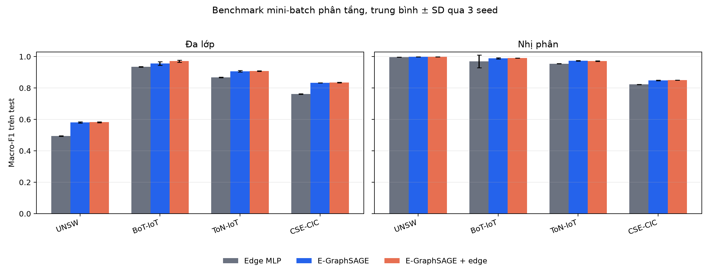

# Báo cáo benchmark E-GraphSAGE mini-batch trên bốn bộ v2

Khởi chạy 2026-09-20, hoàn tất 2026-09-21. Báo cáo này được sinh trực tiếp từ 72 run đã hoàn tất
và đã nạp lại checkpoint để kiểm tra độc lập. Đây là benchmark cục bộ trên
mẫu phân tầng đã chốt trước trong `PROTOCOL_MINIBATCH_VI.md`, chưa phải kết
quả trên toàn bộ 75.987.976 flow.

## Thiết kế đã thực hiện

- Bốn dataset × hai task × ba mô hình × ba seed = 72 run.
- Cấu hình được chọn bằng validation UNSW multiclass: batch
  `2048`, fanout `[10, 5]`, validation macro-F1
  `0.5676`; test chưa được xem trong bước chọn.
- Tổng thời gian fit và đánh giá cộng dồn: 4.56 giờ CPU.
- Số lần có trung bình test macro-F1 cao nhất trong tám cặp dataset/task:
  E-GraphSAGE + edge: 7, E-GraphSAGE: 1.
- Mỗi số trong bảng là trung bình ± độ lệch chuẩn qua ba seed.

Con số "đứng đầu" chỉ mô tả trung bình quan sát được. Ba seed không đủ để
khẳng định khác biệt rất nhỏ có ý nghĩa thống kê.

Kích thước benchmark:

- UNSW: 127,905 flow pilot từ 2,390,275 flow nguồn.
- BoT-IoT: 142,431 flow pilot từ 37,763,497 flow nguồn.
- ToN-IoT: 272,957 flow pilot từ 16,940,496 flow nguồn.
- CSE-CIC: 210,432 flow pilot từ 18,893,708 flow nguồn.

## Kết quả đa lớp

| Dataset | Mô hình | Macro-F1 | Weighted-F1 | Accuracy | Thời gian/run (s) |
|---|---|---:|---:|---:|---:|
| UNSW | Edge MLP | 0.4943 ± 0.0025 | 0.7831 ± 0.0036 | 0.7583 ± 0.0041 | 42.0890 ± 1.1362 |
| UNSW | E-GraphSAGE | 0.5816 ± 0.0038 | 0.8405 ± 0.0011 | 0.8174 ± 0.0014 | 234.1705 ± 36.4460 |
| UNSW | E-GraphSAGE + edge | 0.5823 ± 0.0033 | 0.8392 ± 0.0022 | 0.8163 ± 0.0033 | 233.8903 ± 27.9062 |
| BoT-IoT | Edge MLP | 0.9343 ± 0.0017 | 0.9384 ± 0.0017 | 0.9384 ± 0.0018 | 79.0889 ± 4.1176 |
| BoT-IoT | E-GraphSAGE | 0.9559 ± 0.0122 | 0.9639 ± 0.0034 | 0.9639 ± 0.0035 | 181.7086 ± 62.2506 |
| BoT-IoT | E-GraphSAGE + edge | 0.9707 ± 0.0063 | 0.9741 ± 0.0050 | 0.9741 ± 0.0050 | 199.2466 ± 73.2644 |
| ToN-IoT | Edge MLP | 0.8671 ± 0.0015 | 0.8914 ± 0.0015 | 0.8919 ± 0.0015 | 71.2146 ± 5.2355 |
| ToN-IoT | E-GraphSAGE | 0.9067 ± 0.0047 | 0.9087 ± 0.0047 | 0.9089 ± 0.0048 | 1482.3487 ± 566.9132 |
| ToN-IoT | E-GraphSAGE + edge | 0.9085 ± 0.0017 | 0.9120 ± 0.0021 | 0.9123 ± 0.0021 | 907.0145 ± 66.3580 |
| CSE-CIC | Edge MLP | 0.7621 ± 0.0019 | 0.8795 ± 0.0015 | 0.8813 ± 0.0018 | 24.1106 ± 5.2457 |
| CSE-CIC | E-GraphSAGE | 0.8331 ± 0.0007 | 0.8972 ± 0.0039 | 0.9006 ± 0.0022 | 91.2168 ± 53.9733 |
| CSE-CIC | E-GraphSAGE + edge | 0.8355 ± 0.0022 | 0.8962 ± 0.0019 | 0.9009 ± 0.0023 | 78.7105 ± 15.2863 |

## Kết quả nhị phân

| Dataset | Mô hình | Macro-F1 | Weighted-F1 | Accuracy | Thời gian/run (s) |
|---|---|---:|---:|---:|---:|
| UNSW | Edge MLP | 0.9969 ± 0.0002 | 0.9972 ± 0.0002 | 0.9972 ± 0.0002 | 24.0528 ± 3.7456 |
| UNSW | E-GraphSAGE | 0.9979 ± 0.0001 | 0.9981 ± 0.0001 | 0.9981 ± 0.0001 | 126.3446 ± 19.5665 |
| UNSW | E-GraphSAGE + edge | 0.9980 ± 0.0001 | 0.9981 ± 0.0001 | 0.9982 ± 0.0001 | 201.2695 ± 55.1258 |
| BoT-IoT | Edge MLP | 0.9700 ± 0.0402 | 0.9782 ± 0.0291 | 0.9787 ± 0.0282 | 73.0186 ± 45.5699 |
| BoT-IoT | E-GraphSAGE | 0.9893 ± 0.0038 | 0.9920 ± 0.0029 | 0.9920 ± 0.0029 | 172.9855 ± 30.2207 |
| BoT-IoT | E-GraphSAGE + edge | 0.9905 ± 0.0006 | 0.9929 ± 0.0004 | 0.9929 ± 0.0004 | 173.9152 ± 128.0168 |
| ToN-IoT | Edge MLP | 0.9550 ± 0.0013 | 0.9790 ± 0.0006 | 0.9786 ± 0.0007 | 81.5200 ± 17.4652 |
| ToN-IoT | E-GraphSAGE | 0.9734 ± 0.0017 | 0.9877 ± 0.0008 | 0.9875 ± 0.0009 | 421.7674 ± 54.0884 |
| ToN-IoT | E-GraphSAGE + edge | 0.9722 ± 0.0021 | 0.9871 ± 0.0009 | 0.9870 ± 0.0009 | 245.6133 ± 122.6592 |
| CSE-CIC | Edge MLP | 0.8226 ± 0.0009 | 0.8872 ± 0.0006 | 0.8754 ± 0.0007 | 52.1162 ± 9.1564 |
| CSE-CIC | E-GraphSAGE | 0.8484 ± 0.0016 | 0.9058 ± 0.0010 | 0.8972 ± 0.0011 | 120.7480 ± 23.4066 |
| CSE-CIC | E-GraphSAGE + edge | 0.8505 ± 0.0007 | 0.9073 ± 0.0005 | 0.8990 ± 0.0006 | 156.1817 ± 18.4921 |

## Cách đọc kết quả

`edge_mlp` kiểm tra thông tin trong riêng đặc trưng flow. `sage` dùng embedding
hai endpoint từ lân cận đồ thị. `sage_edge` nối thêm đặc trưng của chính cạnh
vào bộ phân loại, gần với thay đổi chính đang được khảo sát. Vì mẫu test được
giới hạn theo từng lớp, accuracy và weighted-F1 ở đây không ước lượng trực
tiếp hiệu năng theo tỷ lệ tấn công tự nhiên. Macro-F1 và bảng theo lớp phù hợp
hơn cho so sánh nội bộ này.

So với Edge MLP, GNN tốt nhất tăng macro-F1 đa lớp lần lượt khoảng 0,0880
(UNSW), 0,0364 (BoT-IoT), 0,0414 (ToN-IoT) và 0,0735 (CSE-CIC). Việc nối
edge feature vào decoder có hiệu ứng rõ nhất trên BoT-IoT đa lớp (+0,0148
so với `sage`); ở bảy trường hợp còn lại, chênh lệch tuyệt đối chỉ khoảng
-0,0012 đến +0,0025. Vì vậy bằng chứng hiện tại ủng hộ giá trị của topology,
nhưng chưa cho thấy edge feature trực tiếp luôn tạo cải thiện đáng kể.

## Sự cố số học đã xử lý

Khi bắt đầu ToN-IoT, hai trường rate hữu hạn nhưng đạt tới khoảng 1e165 trong
train và 1e261 trong test, làm phép tính phương sai tràn `float64`. Pipeline
dừng ngay do kiểm tra loss hữu hạn. Bản sửa chọn cột có trị tuyệt đối train
lớn hơn 1e20, áp dụng signed `log1p`, rồi mới fit StandardScaler trên train;
lựa chọn cột được lưu trong từng preprocessor. ToN-IoT chọn đúng hai cột
`SRC_TO_DST_SECOND_BYTES` và `DST_TO_SRC_SECOND_BYTES`; validation/test không
được dùng để chọn phép biến đổi. 36 run UNSW/BoT-IoT đã hoàn tất trước đó
không bị ảnh hưởng và được giữ nguyên. Toàn bộ checkpoint sau cùng đều đã
được validator nạp lại thành công.

Kết quả chỉ chứng minh pipeline mini-batch chạy ổn định và có thể so sánh có
kiểm soát trên bốn tập. Chưa được dùng để tuyên bố tốt hơn bài báo gốc: phiên
bản dataset, cách lấy mẫu, split và ngân sách huấn luyện đều khác. Bước nghiên
cứu kế tiếp là chạy cùng protocol trên toàn dữ liệu bằng server, sau đó bổ sung
host/temporal holdout nếu metadata cho phép.

## Bằng chứng tái lập

- `results/minibatch/runs.csv`: 72 run riêng lẻ.
- `results/minibatch/summary.csv`: trung bình và độ lệch chuẩn.
- `results/minibatch/per_class.csv`: precision, recall, F1, support từng lớp.
- `results/minibatch/verification.json`: kết quả nạp checkpoint, tái tạo xác
  suất và tính lại metric.
- `results/minibatch/provenance.json`: phiên bản môi trường và SHA-256 của
  protocol tại lúc bắt đầu.
- `NUMERIC_STABILITY_NOTE_VI.md`: biên bản lỗi tràn số và cách phục hồi.
- Checkpoint và dự đoán đầy đủ nằm ở `research/artifacts/minibatch_runs/` và
  được bỏ khỏi Git vì kích thước lớn.
