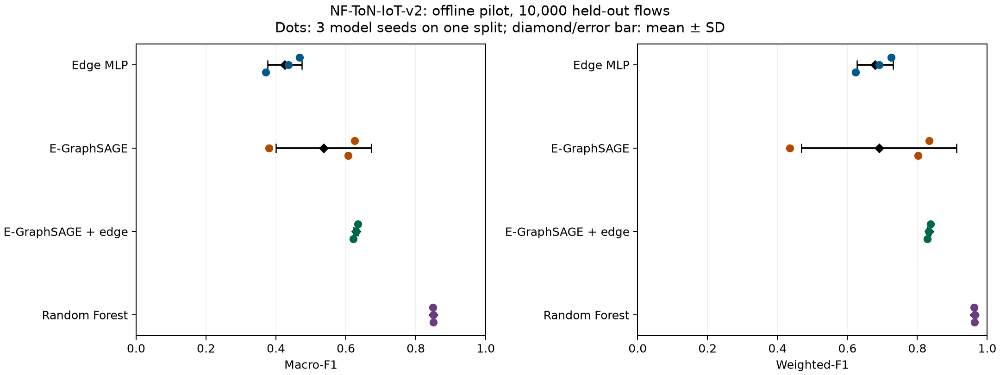
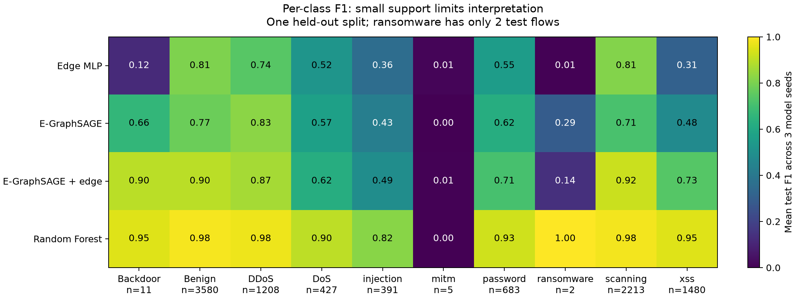

# Báo cáo khởi động lại nghiên cứu E-GraphSAGE

Ngày: 2026-09-19. Kết quả dưới đây được sinh từ 12 lượt thực nghiệm mới,
không sao chép các điểm số cũ trong repo. Đây là **pilot ngoại tuyến trên
50.000 flow**, chưa phải kết quả toàn quy mô hay bằng chứng về tính mới.

## 1. Những gì đã hoàn thành

- Kiểm toán toàn bộ 13,552,395 dòng Parquet GNN đang có.
- Chốt [protocol](PROTOCOL.md) trước khi xem điểm số; lưu checksum protocol,
  source code, dữ liệu và phiên bản thư viện trong provenance.
- Triển khai module độc lập `src/nids_research`, không chạy các script cũ.
- Bốn mô hình × ba seed 11/22/33, cùng split và cùng thông tin đầu vào hợp lệ.
- Lưu scaler, nhãn, cấu hình, trọng số, lịch sử và dự đoán theo ID flow.
- Nạp lại tất cả 12 artifact và dự đoán không cần nhãn: sai lệch xác suất
  lớn nhất 2.22e-16. Biên bản kiểm thử được lưu riêng trong results.

## 2. Kiểm toán dữ liệu: quan sát, không suy đoán

Train cũ: 11.858.347; validation cũ: 1.694.048. Quét cả 5 file, 39 feature
và hai endpoint. Số dòng NaN/Inf ở feature: 0.
Không phát hiện endpoint/nhãn không hợp lệ theo các kiểm tra đã triển khai
(thiếu endpoint/port ngoài khoảng và quan hệ Label–Attack).
Chưa xác nhận tất cả IP bằng parser IP hoặc tính đúng ngữ nghĩa từng feature.

Dấu vân tay gồm feature + endpoint, không gồm nhãn:
- Bản ghi trùng dư: 0.
- Nhóm chung train/validation cũ: 0.
- Nhóm nhãn mâu thuẫn: 0.

Đây là kiểm tra băm hai khóa 64 bit trên dữ liệu đã xử lý, không phải chứng
minh toán học không va chạm hoặc kiểm toán CSV gốc. Không phát hiện trùng
toàn dòng không loại trừ các flow gần giống, cùng host, cùng phiên hoặc cùng
đợt tấn công xuất hiện ở hai tập. Giá trị thiếu đã bị điền 0 trước đó cũng
không thể khôi phục từ Parquet.

Mẫu 50.000 được chọn bằng ưu tiên băm từ toàn bộ train cũ, không lấy riêng
đầu file và không cân bằng lớp. Một đại diện/nhóm được chọn; trong dữ liệu
hiện tại không tìm thấy trùng nên bước đó không loại thêm dòng. Chia mới
35.000/5.000/10.000, không trùng flow ID. Validation cũ không dùng chọn mô hình.

| Lớp | Train | Validation | Test |
|---|---:|---:|---:|
| Backdoor | 39 | 6 | 11 |
| Benign | 12531 | 1790 | 3580 |
| DDoS | 4229 | 604 | 1208 |
| DoS | 1493 | 214 | 427 |
| injection | 1366 | 195 | 391 |
| mitm | 16 | 2 | 5 |
| password | 2389 | 341 | 683 |
| ransomware | 8 | 1 | 2 |
| scanning | 7747 | 1107 | 2213 |
| xss | 5182 | 740 | 1480 |

**Ransomware chỉ có 2 mẫu test, mitm 5, Backdoor 11.** Chỉ một dự đoán thay
đổi có thể làm metric lớp hiếm đổi mạnh. Không dùng pilot này để xác nhận
cải thiện lớp hiếm, dù số điểm có cao. Test mới là holdout nội bộ từ train
cũ; không gọi là bộ dữ liệu ngoài chưa từng được dự án biết đến.

## 3. Kết quả chính

Mean ± SD trên **ba seed mô hình**, cùng một split. SD không phải khoảng
tin cậy hiệu quả triển khai. Các số F1 dưới đây ở thang 0–1.

| Mô hình | Macro-F1 test | Weighted-F1 test | Accuracy test |
|---|---:|---:|---:|
| MLP đặc trưng cạnh | 0.4248 ± 0.0493 | 0.6794 ± 0.0518 | 0.6601 ± 0.0418 |
| E-GraphSAGE baseline | 0.5367 ± 0.1362 | 0.6903 ± 0.2218 | 0.6924 ± 0.2004 |
| E-GraphSAGE + cạnh | 0.6283 ± 0.0062 | 0.8334 ± 0.0046 | 0.8257 ± 0.0058 |
| Random Forest | 0.8498 ± 0.0005 | 0.9637 ± 0.0010 | 0.9636 ± 0.0010 |

Trong đúng pilot này, Random Forest có macro-F1 trung bình cao nhất.
Sage_edge dao động ít hơn sage giữa các seed. Chưa có cơ sở xem
thứ hạng pilot là ưu thế tổng quát của một họ mô hình. Không dùng phép
so sánh này để loại bỏ GNN ở mọi quy mô hoặc mọi protocol, nhất là khi
budget và capacity khác nhau.

Dữ liệu bảng: [runs.csv](results/runs.csv), [summary.csv](results/summary.csv).
Kết quả từng lớp: [per_class.csv](results/per_class.csv); mọi lớp và mọi seed
đều được giữ lại, không chỉ báo lượt tốt nhất.

## 4. Cách đọc và giới hạn kết quả

- Chênh lệch giữa các mô hình chỉ là quan sát trong pilot đã định nghĩa.
  Chưa có kiểm định xác nhận ngoài mẫu hoặc nhiều split độc lập.
- Sage và sage_edge dùng cùng encoder/siêu tham số; sage_edge chỉ thêm
  đặc trưng cạnh vào linear head. So sánh này kiểm tra đường đặc trưng
  trực tiếp, không phải toàn bộ biến thể MLP head của repo cũ.
- MLP có 6.410 tham số, sage 88.586, sage_edge 88.976; không cùng capacity.
  Random Forest dùng 100 cây cố định, không tune. Không suy ra ưu thế
  bản chất của một họ mô hình từ ngân sách này.
- Neural models full-batch: 1 epoch = 1 bước cập nhật. Tối đa 120 bước,
  patience=20; có thể chưa hội tụ. Giữ nguyên các lượt early-stop sớm,
  không loại seed kém hoặc kéo dài chỉ một mô hình sau khi xem test.

| Mô hình | Seed | Epoch tốt nhất theo val | Epoch đã chạy |
|---|---:|---:|---:|
| edge_mlp | 11 | 74 | 94 |
| edge_mlp | 22 | 65 | 85 |
| edge_mlp | 33 | 22 | 42 |
| sage | 11 | 110 | 120 |
| sage | 22 | 7 | 27 |
| sage | 33 | 76 | 96 |
| sage_edge | 11 | 111 | 120 |
| sage_edge | 22 | 115 | 120 |
| sage_edge | 33 | 101 | 120 |

Đồ thị train có 38,009 đỉnh, khoảng
83.7% có bậc endpoint bằng 1.
Khoảng 74.5% flow test có ít nhất
một endpoint IP:port chưa thấy trong train. Endpoint mới không đồng nghĩa
host/network mới: đổi port cũng tạo endpoint mới. Mẫu ngẫu nhiên làm thay
đổi topology, nên chưa ngoại suy lợi ích sang graph đầy đủ.

Đầu phân loại chỉ dựa vào cặp đỉnh có giới hạn với nhiều flow cùng endpoint,
nhưng chẩn đoán hậu nghiệm ở test này chỉ thấy
1 cặp endpoint chứa nhiều nhãn.
Do đó không được coi giới hạn đó là nguyên nhân đã chứng minh của mọi sai số.

## 5. Đối chiếu bài báo và sửa diễn giải cũ

- Đây là baseline thích nghi v2, không tái lập nguyên trạng E-GraphSAGE.
  Bảo toàn endpoint thay vì random IP từng dòng; không target-encode;
  split 70/10/20; eval mode; checkpoint theo val; chấm một lần/flow.
- Bài gốc NF-ToN-IoT khác v2; weighted-F1 0,63 đa lớp khác macro-F1 và
  binary-F1. Không dùng các con số đó làm phép đối chứng trực tiếp.
- Bảng V của PDF v8 đã có DoS/XSS F1=0; không gọi thất bại lớp hiếm là
  khám phá mới chỉ dựa vào kết quả cũ.
- Script biểu đồ cũ chuẩn hóa lại validation. Các số cũ phải được đánh
  giá lại bằng đúng scaler train trước khi dùng cho bài viết.

Xem [ghi chú nguồn](EVIDENCE_NOTES_VI.md) cho nguồn đã kiểm tra và phạm vi đọc.

## 6. Hướng nghiên cứu tiếp theo đã chốt

**Ưu tiên độ tin cậy của so sánh trước khi thêm kiến trúc mới.**

1. Chạy nghiên cứu hội tụ/early-stopping trên validation của một protocol
   phát triển riêng, cùng ngân sách cho neural baselines. Không dùng test
   pilot đã xem để xác nhận các lựa chọn mới.
2. Có raw CSV hoặc dữ liệu chứa timestamp/nhóm phiên đáng tin cậy để
   kiểm chứng bước tiền xử lý trước Parquet và thiết kế holdout phù hợp.
3. Tăng cỡ dữ liệu để có đủ lớp hiếm; báo số mẫu và khoảng bất định phù
   hợp cấu trúc phụ thuộc. Nhiều seed không thay thế nhiều mẫu hiếm.
4. Kiểm tra độ nhạy một chiều/hai chiều, feature encoding, graph context
   và sampling bằng ablation thay từng yếu tố; thêm MLP gần capacity nếu
   muốn quy lợi ích cho topology chứ không chỉ năng lực mô hình.
5. Chạy trên dữ liệu/mạng khác với nhãn và protocol tương thích trước khi
   tuyên bố tổng quát. Đọc đầy đủ nghiên cứu liên quan trước khi chốt tính mới.

**Trạng thái:** nền kỹ thuật và vòng pilot đã hoàn tất; nghiên cứu toàn quy
mô, tính mới và khả năng triển khai chưa được xác nhận.

## 7. Tái lập và skill

Xem [RUNBOOK_VI.md](RUNBOOK_VI.md) cho lệnh chuẩn bị, huấn luyện và dùng model.
Các artifact lớn ở `research/artifacts/` được bỏ qua khi git add; báo cáo,
metric và biểu đồ nhỏ ở `research/results/` có thể kiểm tra/commit.

Đã áp dụng nckh: scientific-critical-thinking, experimental-design,
scikit-learn, exploratory-data-analysis và scientific-visualization.
Đã ghi nhận nguồn hỗ trợ quy trình: Kassis, T., Agarwal, V., He, Y., Patel,
D., & Brueckner, A. M. (2026), [Scientific Agent Skills](https://doi.org/10.48550/arXiv.2609.00065).
Nguồn này không cung cấp bằng chứng hiệu năng NIDS của pilot.
